# Challenge 3: Implement Login Functionality using Azure Function App.

In this challenge you will be implementing the Login Function in local environment, testing it with frontend app and deploye it to Azure Funtions App.

> **Note:** We will use VS Code to implement Azure Funtion localy.
For that you need to install following **extension** for VS code:
> 1. Azure Resources
> 1. Azure Functions

**Before you start add the above listed extension to VS code.**


## Tasks
1. Implement Login Function in local environment.
1. Deploy Login Function to Azure Functions.


### Task 1: Implement Login Function in local environment.

1. Open a VS code, Select **Azure** on the left panel then click on **Azure Function icon** in the workspace and select **Create New Project**.

    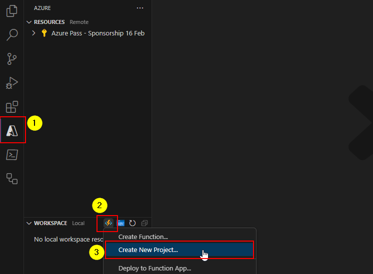

1. Next, select the location to create the function resource, create a new directory **AuthService** and select that directory.

    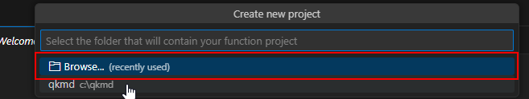

1. Next, select a language **c#**.

    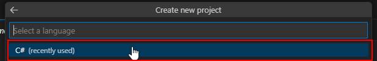
1. Next, Select a .Net runtime **.Net 6.0 LTS**.

    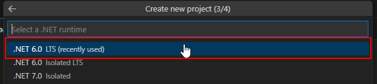
1. Next, select trigger ***HTTP trigger**.

    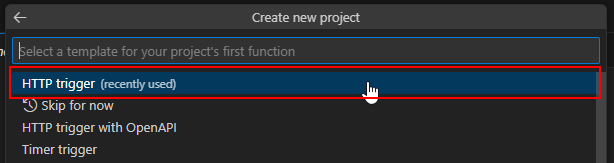
1. Next, Give function name **LoginFunction** and press *Enter*.

    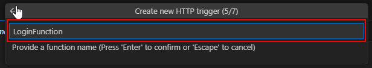
1. Next, Provide a namespace **AuthService** and press *Enter*.

    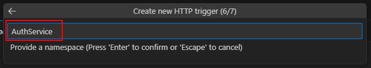
1. Next, Select AccessRights as **Function**.

    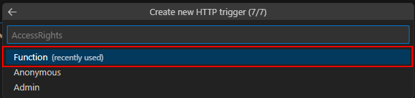

1. Select **Explorer** in VS code, open *local.setting.json* file and replace the content with:

    ```
    {
        "IsEncrypted": false,
        "Values": {
            "AzureWebJobsStorage": "UseDevelopmentStorage=true",
            "FUNCTIONS_WORKER_RUNTIME": "dotnet"
        },
        "ConnectionStrings": {
            "SqlDBConnectionString": ""
        },
        "Host": {
            "LocalHttpPort": 7071,
            "CORS": "*"
        }
    }
    ```

1. In *local.setting.json* file, under **ConnectionStrings** property provide the value to **SqlDBConnectionString** (*i.e. Connection String of your SQL Database*).

1. Open integrated terminal, run following command to install *System.Data.SqlClient version 4.8.3* package:

    ```
    dotnet add package System.Data.SqlClient --version 4.8.3
    ```

1. Open **LogincFUnction.cs** file and replace the whole code with the following code:

    ```
    using System;
    using System.IO;
    using System.Threading.Tasks;
    using Microsoft.Azure.WebJobs;
    using Microsoft.Azure.WebJobs.Extensions.Http;
    using Microsoft.AspNetCore.Http;
    using Microsoft.Extensions.Logging;
    using Newtonsoft.Json;
    using System.Data.SqlClient;
    using Microsoft.Extensions.Configuration;

    namespace AuthService
    {
        public static class LoginFunction
        {
            [FunctionName("LoginFunction")]
            public static async Task<int> Run(
                [HttpTrigger(AuthorizationLevel.Function, "post", Route = null)] HttpRequest req,
                ILogger log, ExecutionContext context)
            {
                log.LogInformation("C# HTTP trigger function processed a request.");

                string requestBody = await new StreamReader(req.Body).ReadToEndAsync();
                dynamic data = JsonConvert.DeserializeObject(requestBody);
                
                string userEmailID  = data.emailID;
                string userPassword = data.password;
                string userType     = data.usertype;
                int result          = 0;

                var config = new ConfigurationBuilder()
                .SetBasePath(context.FunctionAppDirectory)
                .AddJsonFile("local.settings.json", optional: true, reloadOnChange: true)
                .AddEnvironmentVariables()
                .Build();
                
                string connectionString = config.GetConnectionString("SqlDBConnectionString");
                //string connectionString = Environment.GetEnvironmentVariable("SqlDBConnectionString");

                SqlConnection sqlConnection = new(connectionString);
                SqlCommand sqlCommand = new(
                    "select [dbo].ufn_ValidateLogin(@userEmailID,@userPassword,@customerType)",
                    sqlConnection
                );

                sqlCommand.Parameters.AddWithValue("@userEmailID", userEmailID);
                sqlCommand.Parameters.AddWithValue("@userPassword", userPassword);
                sqlCommand.Parameters.AddWithValue("@customerType", userType);

                try
                {
                    sqlConnection.Open();
                    result = Convert.ToInt32(sqlCommand.ExecuteScalar());
                }
                catch (Exception e)
                {
                    result = -1;
                    log.LogInformation("Exception Occured\n\n" + e.Message + "\n\n");
                }
                finally
                {
                    sqlConnection.Close();
                }

                return result;
            }
        }
    }

    ```

1. In inetrated terminal, type the following command to start your function app locally.

    ```
    func start
    ```

    > Note: if above command give error then you need to install **Azure Functions Core Tools** from [here](https://learn.microsoft.com/en-us/azure/azure-functions/functions-run-local) and then try again (also, you may need to restart your terminal if its not working after installation of core tool).

1. Once function app started in termial, copy the **LoginFunction** Url.

    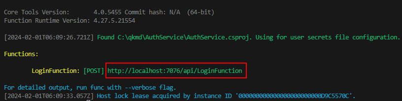

1. Open your QuickKart Frontend project in VS code, open file *home-page.service.ts* which is under **src>app>home>HomePage-Services** and update the URL in **ValidateUser** function with the **LoginFunction** URL copied in previous step.

    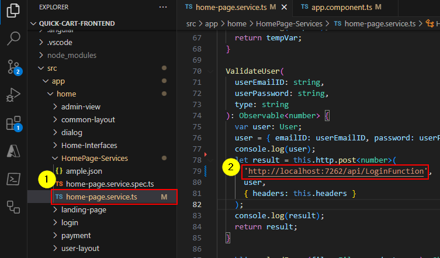

#### Test the login functionality of Frontend App:
1. Make sure you backend is running, if not then start your backed.

1. Ignore this step if your backend is already running, 
    
    Open a terminal, naviagte to **Quick-Cart-Backend** then run:

    ```
    cd QuickKartWebService
    dotnet run
    ```

    > Note: If the backend URL change then update your FrontEnd App (*i.e.* home-page.service.ts->getProducts() URL)

1. Also, make sure your function app is running if not then start it again as done previously in step 13.

    > Note: If the function app URL change then update your FrontEnd App (*i.e.* home-page.service.ts->ValidateUser() URL)

1. In Frontend App, click on login and provide the following details:

    Enter Your Emai ID: `customer1@cloudthat.com`

    Enter Your Password: `cust@1234`

    Select `Customer` Radio Button 

    Select **Login** Button

    If everything goes write a **Logged in successfully** popup notification will come.

    > **Note:** if you are getting an error then check browser console for more detail or check function app terminal.

    > To check in browesr press *ctrl+shift+i*

1. Cancle all run in termial and close them.


### Task 2: Deploy Login Function to Azure Functions.
1. Go back to VS code of your function app, navigate to Azure Icon.

1. Add your azure account subscription.

1. In workspace section click on workspace function **icon** and select **Create new Function App in Azure**.

    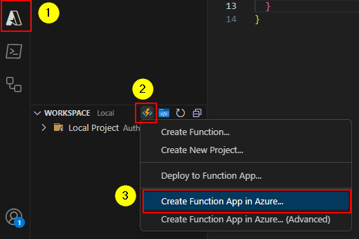

1. Enter a globally unique name for the new function app and press Enter to confirm.

1. Select the runtime stack: `.Net 6 (LTS)`.

1. Select the location for new resource: **same as your backed app** (*for example: Central India*).

1. Wait for the deployment to finished, Once deployemt finished it gives you a notification with Azure function app url note it down.

1. Go back to workspace section,  click on workspace function **icon** and select **Deploy to Function App**.

    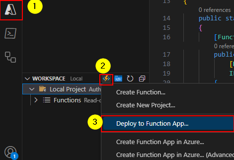

1. Select the folder to deploy: `Select the name or browse location of Login Function`.

1. Select resource: `select the name of Azure Function App created in the previous step`

1. Selecy Yes or Deploy if a popup appear and wait for the deployment.

1. Now update your frontend app, **src>app>home>HomePage-Services>home-page.service.ts** and update the URL in **ValidateUser** Function with the URL as follows:

    > **Note:** You have to replace *http://localhost:7071* with your Azure Function App url *https://azuthservice34x.azurewebsites.net*

    Previous URL: `http://localhost:7071/api/LoginFunction`

    New URL will be: `https://azuthservice34x.azurewebsites.net/api/LoginFunction`

1. Once updated re-run your frontend app and test the login functionality as previous.