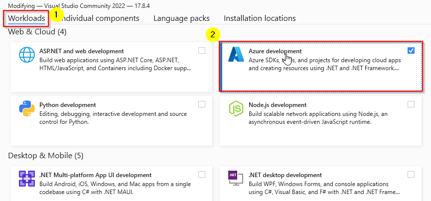
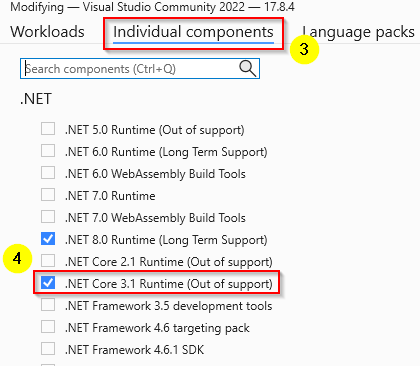
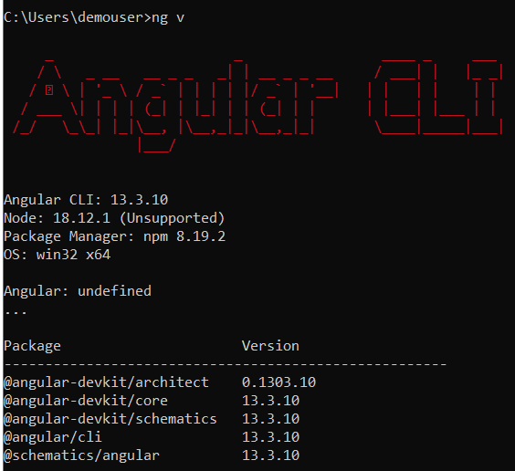
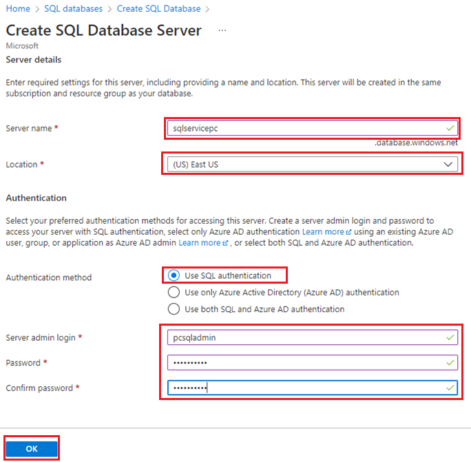
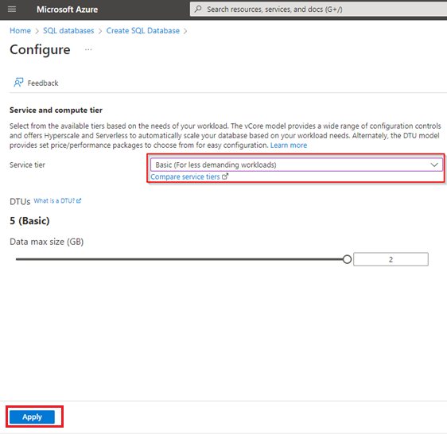
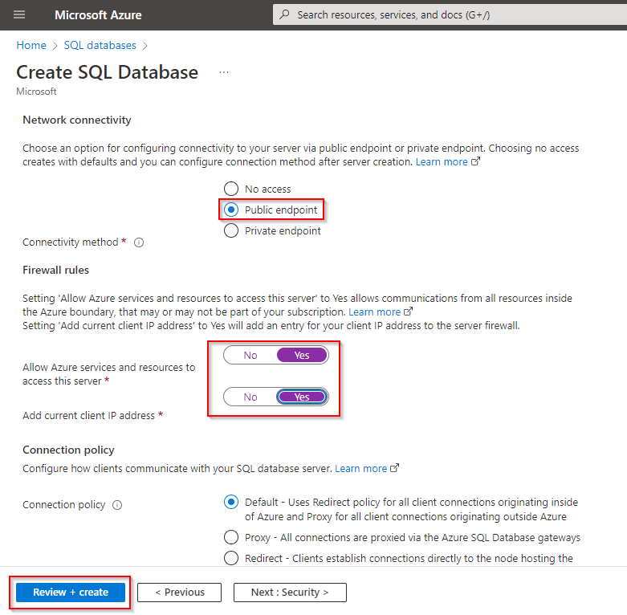
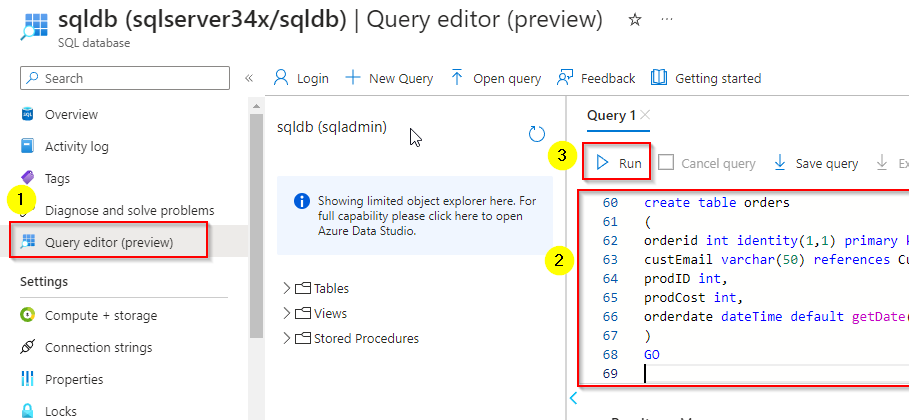
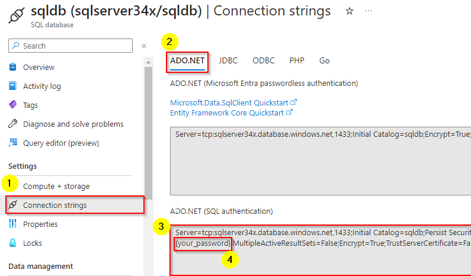
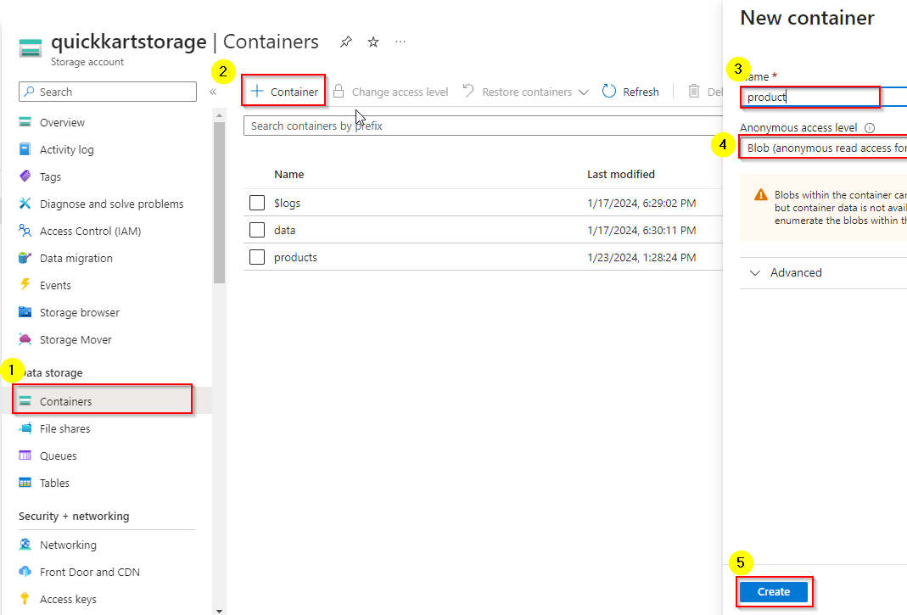

# Challenge 2: Setup a Local Development Environment.

In this challenge you have to setup a local development environment with required Azure Resources.

## Tasks
1. Setup local development requirements.
1. Create Azure SQL Database and load data.
1. Create Azure Storage Account and upload files.
1. Test the frontend and backend code locally first
1. Deploy frontend and backend code to Azure PAAS Services

### Task 1. Setup local development requirements.
1. Download Visual Studio Community 2022 & install it with Azure Development SDK and .Net 3.1.
   <https://visualstudio.microsoft.com/vs/community/>
   
   
1. Download VS Code
   <https://code.visualstudio.com/download)>
1. Install Git <https://git-scm.com/downloads>
1.	Open command prompt **(cmd)** and check the git version

    ```git -v```

1.	Install Node.js (18.19.0) from <https://nodejs.org/download/release/v18.19.0/>
1. Install Angular CLI

   ```npm install -g @angular/cli@13.3```

   Check if the version is installed:

   ```ng v```

   

1. Create a directory name **quickkart**, in the terminal:
   ```
   cd\
   md quickkart
   cd quickkart
   ```

1. Clone the front-end repository using below url:

   ```
   git clone https://github.com/pankajdev0ps/Quick-Cart-FrontEnd
   ```

1. After cloning open **cmd** and navigate to **quickkart** directory where you have cloned the repository and install node module
   ```
   cd Quick-Cart-FrontEnd
   npm install
   ```

   > **Note:** This will create the Node_Modules for Quick-Cart-FrontEnd project

1. Go back to terminal and start the application: 

    ```
    ng s -o
    ```
    As of now it will show miising images in the web page, you can stop it by pressing *ctlr+c* ni terminal.


### Task 2. Create Azure SQL Database and load data. 
1. In the Azure portal, select **＋ Create a resource** from the upper left-hand corner and search for Azure SQL. Then in the resulting **Azure SQL** page, select **Create**.

2. Review the Azure SQL options that are available, and then in the SQL databases tile, ensure **Single database** is selected and select Create.
    - **Subscription:** Select your Azure subscription.
    - **Resource group:** Create a new resource group `Quickkart-RG`
    - **Database name:** `quickkart`
    - **Server:** 
        - Select Create new and create a new server with a **unique
        name** in any available location. 
        - Use **SQL authentication** and specify `sqladmin` as the server admin login and a suitably `Pa55w.rd` password. (**remember the password** - you'll need it later!)
        - Select **OK**
        
        
    - **Want to use SQL elastic pool?**: No
    - **Workload environment:** Development
    - **Compute + storage:** Select change configuration
        - **Service Tier:** Basic
        - click **Apply**

        

        
    - **Backup storage redundancy:** Locally-redundant backup storage

3. On the Create SQL Database page, select **Next :Networking >**, and on the Networking page, in the Network connectivity section, **select Public endpoint**. 

   Then **select Yes for both options** in the Firewall rules section to allow access to your database server from **Azure services** and **your current client IP address.**

4. Select **Review + Create**, and then select **Create** to create Azure SQL database.

   

> Wait for deployment to complete. Then go to the resource that was deployed.

#### Load data to **quickkart** database
1. In the pane on the left side, in the top section, select **Query editor (preview)**.
1. Login to database, use username and passwoord provided in the previous step.
1. In **Query editor (preview)**, Copy the following query and paste inside the **query1** then select **Run**.

   

    ```
    create table Product
    (
    ProductID int identity primary key,
    ProductName varchar(50),
    ProductPrice numeric(10),
    Vendor varchar(50),
    Discount int,
    ProductImage varchar(1000)
    )
    GO

    insert into Product values('Sony Camera',20000,'Sony India',10,'Point_and_shoot_cameras.jpg')
    insert into Product values('Samsung TV',34000,'Samsung India',20,'TV.jpg')
    insert into Product values('Apple watch',30000,'Apple India',12,'watch.jpg')
    insert into Product values('TMC Protien',4000,'TMC India',15,'supplement.jpg')
    insert into Product values('US Polo Shirt',2500,'US Polo India',17,'shirt.jpg')
    insert into Product values('Aviator Eye glass',1000,'Aviator India',20,'eyewear.gif')
    insert into Product values('Spyker Jeans',2000,'Spyker India',50,'jeans.jpg')
    insert into Product values('Jumpsuit',500,'Rst India',20,'jumpsuits.gifs')
    GO

    create table Customers
    (
    customerID int identity(1000,1) primary key,
    emailID   varchar(50) unique,
    FirstName varchar(50),
    LastName  varchar(50),
    Pincode   numeric(6),
    [password] varchar(50),
    userType char(1)
    )
    GO

    insert into Customers values('customer1@cloudthat.com','Aplha','User',231216,'cust@1234','c')
    Go

    create table Subscribers
    (
    subscriberID int identity primary key,
    emailID varchar(100) unique
    )
    GO

    create table Vendors
    (
    vendorID   int   identity primary key,
    vendorName varchar(200),
    vendorEmailID  varchar(200),
    vendorPassword varchar(200),
    customerType char(1) default 'v'
    )
    GO

    insert into vendors(vendorName,vendorEmailID,vendorPassword) values('Reebok','Rebok@quickcart.com','Kmail@1234')
    insert into vendors values('Adidas','Adidas@quickcart.com','Kmail@1234')
    insert into vendors values('Apple','Apple@quickcart.com','Kmail@1234')
    insert into vendors values('Oneplus','Oneplus@quickcart.com','Kmail@1234')
    GO

    create table orders
    (
    orderid int identity(1,1) primary key,
    custEmail varchar(50) references Customers(emailID),
    prodID int,
    prodCost int,
    orderdate dateTime default getDate()
    )
    GO

    ```

1. In the left pane of SQL Database, select **Connection strings** under **Setting**
1. In **Connection strings** page, copy **ADO.NET (SQL authentication)** connection string.
1. Open a notepade and paste connection string in it.
1. Replace *{your_password}* in connection string that you copied in previous step with **your database password**.
   
   

### Task 3. Create Azure Storage Account and Upload files.

1. On the Azure portal home page, select **+ Create a resource** from the upper left-hand corner and search for *Storage account*. Then in the resulting **Storage account** page, select **Create**.
1. Enter the following values on the **Create a storage account** page:
    - **Subscription**: Select your Azure subscription.
    - **Resource group**:  Select exisiting resource group `Quickkart-RG`.
    - **Storage account name**: Enter a unique name for your storage account using lower-case letters and numbers.
    - **Region**:  Select same location as Azure SQL DB `quickkart`.
    - **Performance**: *Standard*
    - **Redundancy**: *Locally-redundant storage (LRS)*

1. Select **Review**, and then select **Create** to create Azure Storage.<br>
1. Wait for deployment to complete. Then go to the resource that was deployed.

#### Upload Bolb to Azure Storage Blob Container

1. Download the all file from [assets](../assets) folder and save it on your computer (you can save it in any folder - you'll upload it to blob storage later).
1. To allow anonymous access for a storage account in the Azure portal, follow these steps:
   - Navigate to your storage account in the Azure portal.
   - Locate the **Configuration** setting under **Settings**.
   - Set Allow Blob anonymous access to **Enabled** .
1. Select **Containers** in the **Data storage** section.
1. In the **Containers** page, select **&#65291; Container** and add a new container named **products** with a public access level of **Blob (anonymous read access for blobs only)**.
   
   
1. When the **products** container has been created, verify that it's listed in the **Containers** page.
1. In the pane on the left side, in the top section, select **Storage browser**.
1. In the storage browser page, select **Blob containers** and then select the listed **products** container.

1. Use the **&#10514; Upload** button to open the **Upload blob** panel.
1. In the **Upload blob** panel, select the all files you saved on your local computer previously. 
1. Select the **Upload** button.
1. Close the **Upload blob** panel if it's still open, and verify that **products** container contains all the files you uploaded.
1. In **Security + networking** section, select **Acccess Keys**.
1. In the **Access Keys** page, for **key1** select **show** for **Connection string** and copy the connection string and paste it in the notepad.


### Task 4. Test the frontend and backend code locally

#### Task 4.1 Run the Backend Dotnet App

1. Clone the backend Project

    ```
    git clone https://github.com/pankajdev0ps/Quick-Cart-Backend
    ```

1. Open backend project either in Visual Studio or in VS Code. 
    > **Note:** This document uses VS Code.

1. Open a new terminal and navigate to **Quick-Cart-Backend** cloned repo and type the following command:

    ```
    code .
    ```
1. In **QuickKartWebService** project, open appsetting.json file and update the followings and save:
   - **DBConnectionString**: paste the ADO.NET (Connestion string) copied earlier in the notepad.
   - **StorageConnectionString**: paste the Connection string copied eralier in the notepad.
   - **StorageUri**: replace `<storage_account_name>` with your storage account name.
   
1. Run the backend app, go back to terminal if your termial is at **Quick-Cart-Backend** then run:

    ```
    cd QuickKartWebService
    dotnet run
    ```

    > **Let the backend app keep running in the terminal**

#### Task 4.2 Run the Frontend Angular App
1. Open a new termianl, naviagte to **Quick-Cart-FrontEnd** cloned repo and type the following command:
    > **! Important:** Make sure you have install node and anguler as mentioned in Task 1

    ```
    npm install
    ```
    > Ignore warnings

1. Once installtion finished, run the following command in terminal to open VS Code:

    ```
    code .
    ```

1. Go back to terminal and run below command to start your angular app this will open the app in a deafult browser:

    ```
    ng s -o
    ```
1. Verify the app running in the browser


### Task 5. Deploy frontend and backend code to Azure PAAS Services

#### Task 5.1 Deploy Frontend to Azure Static Web App.


#### Task 5.2 Deply Backend to Azure App Service Web App.

